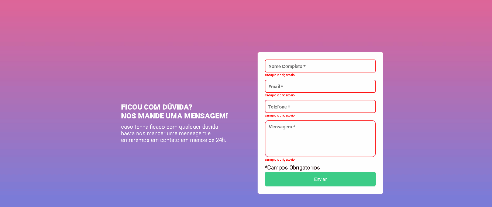

# Formulário com Validação e Efeitos Visuais

Este projeto é um **formulário interativo** que valida os campos de entrada (**inputs e textarea**) e fornece feedback visual ao usuário. Quando o formulário é preenchido corretamente, um efeito de confetes é acionado para indicar sucesso.

## 🚀 Funcionalidades

- **Validação de campos**: Os campos obrigatórios são destacados em vermelho caso estejam vazios.
- **Feedback visual**:
  - Campos válidos são destacados em **verde**.
  - Mensagens de erro aparecem ao lado dos campos inválidos.
- **Efeito especial**: Um efeito de **confetes** é acionado quando todos os campos são preenchidos corretamente.

## 🛠 Tecnologias Utilizadas

- **HTML**: Estrutura do formulário.
- **CSS**: Estilização dos campos, feedback visual.
- **JavaScript**: Validação dinâmica e efeito de confetes.
- **Biblioteca Confetti.js**: Para animação ao final do preenchimento correto.

## 📜 Como Funciona

1. O usuário preenche os campos do formulário.
2. Ao clicar no botão de envio:
   - Os campos vazios ficam vermelhos e uma mensagem de erro aparece.
   - Os campos preenchidos corretamente ficam verdes.
   - Se todos os campos estiverem corretos, um efeito de **confetes** é acionado.

## 📂 Estrutura do Projeto

```
/formulario-validacao
│── index.html
│── style.css
│── script.js
│── confetti.min.js
```

## 🎉 Demonstração Visual

 


## 📌 Como Executar

1. Baixe ou clone o repositório.
2. Abra o arquivo `index.html` em um navegador.
3. Teste o formulário preenchendo os campos e observando o feedback visual.

## 📌 Contribuição

Sinta-se à vontade para contribuir! Fork o repositório, faça alterações e envie um pull request. 🚀

